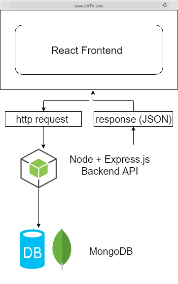

# UXTK: User eXperience Research Toolkit

We will be putting together all the pieces we've learned so far in a feature-rich, expansive project. This part is totally optional, but following along will aid in your understanding of the MERN stack. 

The project repo is located [here](https://github.com/DED8IRD/UX-Research-Toolkit)

Like the WhatTodo app, I have separated the code progression by core concepts into their own branch with their relating READMEs. You might find that particular features will be useful for your capstone projects and you can look for help there. 

## Overview
The UX Research Toolkit (UXTK) is a web application that streamlines user feedback collection. UXTK sends out mass emails to a sample of a website's user base requesting feedback on the site. This feedback will include quantifiable as well as qualitative user information that you can conduct UX research and development from to improve your app or service. This is a paid service, where our primary customer will be project managers and project owners looking for a service to collect UX information.

## Features
- User registration via Google OAuth
- Payment via Stripe
- User customizable surveys
- UXTK tabulates feedback, runs stats on quantifiable inputs, and returns a report of all survey responses

- User registration via Google OAuth
	- Express server + MongoDB + PassportJS
- Payment via Stripe
	- Stripe + MongoDB
- User customizable surveys
	- React + Redux
- UXTK tabulates feedback, runs stats on quantifiable inputs, and returns a report of all survey responses

## Application Workflow and Stack
Here's a step by step walkthrough of how a this application works and the technology utilized in each step:
1. User registers and logs in via Google OAuth
	- Express, MongoDB, PassportJS
2. User pays for service credits via Stripe
	- Stripe, MongoDB
3. User creates new survey
	- React, Redux
4. User enters email list
	- React, Redux, Redux Form
5. UXTK sends email to UX subjects from email list
	- Email Provider
6. UX subjects click link in email to provide feedback
	- Email Provider, Express, MongoDB
7. UXTK tabulates feedback, runs stats on quantifiable inputs
	- MongoDB, Mongoose
8. User sees report of all survey responses
	- MongoDB, React, Redux

## Application Architecture

- Frontend: React
- Node/Express API to communicate between React frontend and MongoDB
- DB: MongoDB 